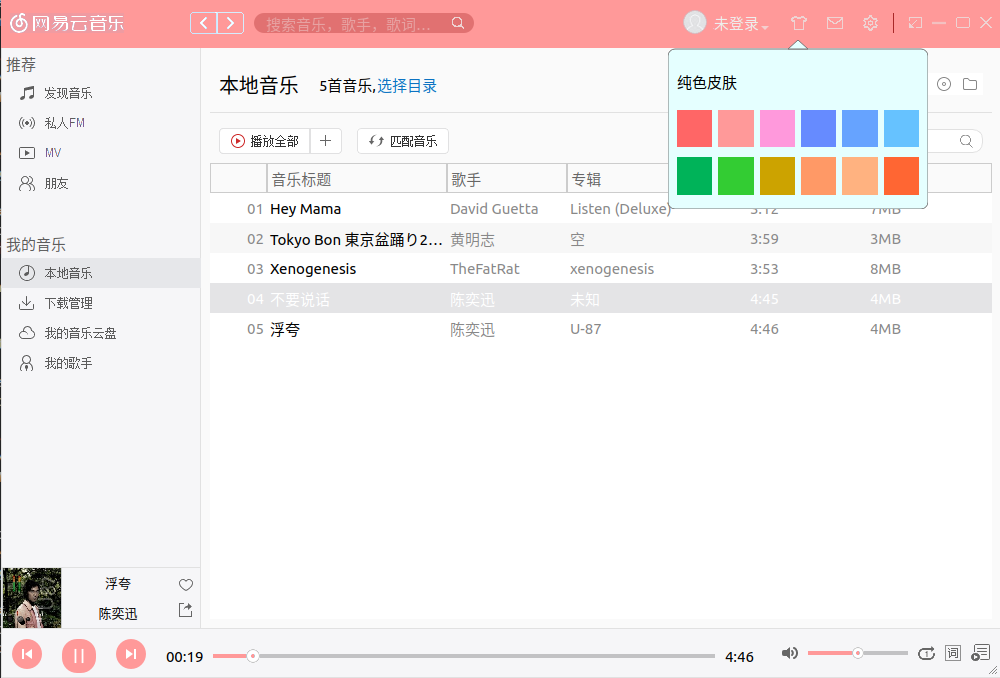
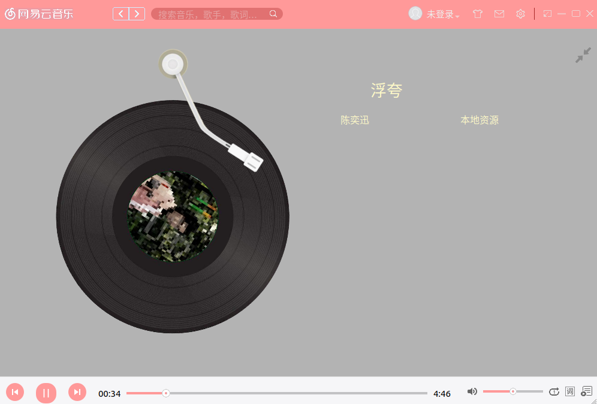
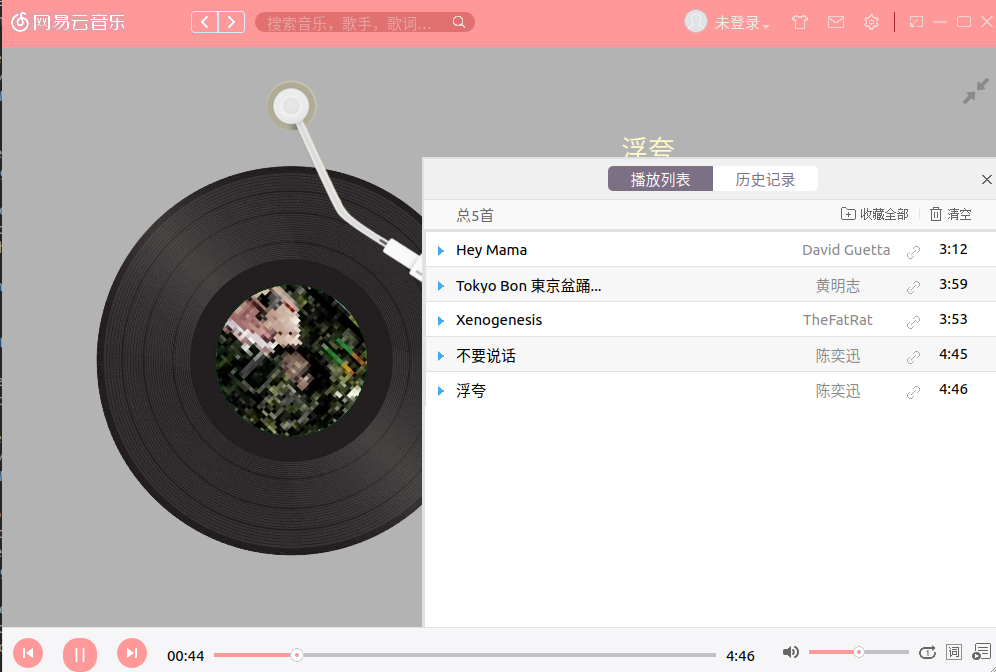

## CloudMusic made by Qt

 这个小demo是模仿网易云音乐的界面做的音乐播放器，开发环境是ubuntu18+Qt5；

起因是：网易云音乐播放器在ubuntu18上有莫名奇妙的bug 只适配到ubuntu16，于是想着自己动手

：）------------------------------------------------------------------------------------------------

#### 先上效果图：

目前只做了这么多，本地播放的功能有了，网络播放的功能还未实现；近期会去研究下网易云音乐的网络借口

争取尽快吧网络部分弄出来

|---------------------------------------------------------------------------------------------------------------------

最后最后，如果觉得还行请Star！！！

ORZ ORZ